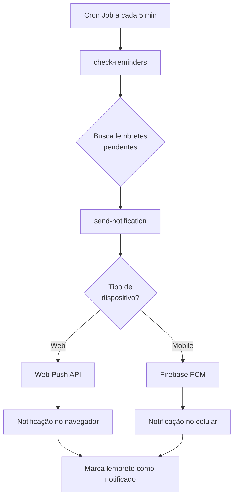

# 📱 Configuração de Notificações Push

## ✅ Itens Concluídos

- ✅ Tabela `notification_tokens` criada
- ✅ Campos `notification_sent` e `last_notification_at` adicionados à `tbl_lembrete`
- ✅ Capacitor Push Notifications instalado
- ✅ Service Worker atualizado com handlers de notificação
- ✅ Edge Functions criadas (get-vapid-key, check-reminders, send-notification)
- ✅ Secrets configuradas (VAPID_PUBLIC_KEY, VAPID_PRIVATE_KEY, VAPID_EMAIL, FCM_SERVER_KEY)
- ✅ Interface de configuração de notificações criada

## 🔧 Configuração Necessária: Cron Job no Supabase

Para que as notificações sejam enviadas automaticamente, você precisa configurar um cron job no Supabase que executará a função `check-reminders` a cada 5 minutos.

### Passo 1: Acessar o SQL Editor do Supabase

1. Acesse seu projeto no [Supabase Dashboard](https://supabase.com/dashboard)
2. Vá em **SQL Editor** no menu lateral
3. Clique em **New Query**

### Passo 2: Executar o SQL do Cron Job

Cole e execute o seguinte SQL (substitua `SEU_PROJECT_ID` pelo ID do seu projeto):

```sql
-- Ativar extensões necessárias
CREATE EXTENSION IF NOT EXISTS pg_cron;
CREATE EXTENSION IF NOT EXISTS pg_net;

-- Criar cron job que executa a cada 5 minutos
SELECT cron.schedule(
  'check-reminders-every-5-minutes',
  '*/5 * * * *', -- A cada 5 minutos
  $$
  SELECT net.http_post(
    url := 'https://SEU_PROJECT_ID.supabase.co/functions/v1/check-reminders',
    headers := jsonb_build_object(
      'Content-Type', 'application/json',
      'Authorization', 'Bearer ' || current_setting('app.settings.service_role_key')
    )
  ) as request_id;
  $$
);
```

### Passo 3: Verificar o Cron Job

Para verificar se o cron job foi criado corretamente:

```sql
-- Listar todos os cron jobs ativos
SELECT * FROM cron.job;

-- Ver histórico de execuções
SELECT * FROM cron.job_run_details ORDER BY start_time DESC LIMIT 10;
```

### Passo 4: Testar as Notificações

1. **Criar um lembrete de teste**:
   - Vá em Lembretes
   - Crie um lembrete com data/hora próxima (ex: daqui 2 minutos)

2. **Ativar notificações**:
   - Vá em Configurações
   - Clique em "Ativar Notificações" no card de Notificações Push
   - Permita as notificações quando o navegador solicitar

3. **Aguardar**:
   - O cron job verificará lembretes a cada 5 minutos
   - Você receberá a notificação quando o horário do lembrete chegar

### Passo 5: Monitorar Logs (Opcional)

Para ver os logs das edge functions:

1. Acesse **Edge Functions** no menu do Supabase
2. Clique na função desejada (check-reminders, send-notification)
3. Vá na aba **Logs** para ver a execução

## 📊 Como Funciona



## 🔐 Segurança

- ✅ Secrets armazenadas de forma segura no Supabase
- ✅ Tokens de notificação por usuário
- ✅ RLS policies aplicadas em `notification_tokens`
- ✅ Autenticação necessária para registrar tokens

## 🎯 Funcionalidades

### Web (PWA)
- ✅ Notificações via Web Push API
- ✅ Funciona mesmo com navegador fechado (se PWA instalado)
- ✅ Botões de ação (Ver detalhes / Dispensar)
- ✅ Ícone e badge personalizados

### Mobile (Android/iOS)
- ✅ Notificações via Firebase Cloud Messaging
- ✅ Funciona com app em background ou fechado
- ✅ Som e vibração nativos
- ✅ Badge de notificações

## 🔄 Próximos Passos

Após configurar o cron job:

1. **Testar em diferentes dispositivos**:
   - Desktop (Chrome, Firefox, Edge)
   - Mobile (Android, iOS)

2. **Ajustar configurações** (se necessário):
   - Mudar intervalo do cron job
   - Customizar mensagens das notificações
   - Ajustar horário de verificação

3. **Monitorar performance**:
   - Ver logs das edge functions
   - Verificar taxa de entrega
   - Ajustar conforme necessário

## ❓ Troubleshooting

### Notificações não aparecem
1. Verificar se o cron job está ativo
2. Verificar logs da função `check-reminders`
3. Confirmar que existem lembretes pendentes no horário correto
4. Verificar se o token foi salvo em `notification_tokens`

### Erro ao ativar notificações web
1. Usar HTTPS (localhost também funciona)
2. Verificar se o navegador suporta Push API
3. Limpar cache e registrar novamente o service worker

### FCM não funciona no mobile
1. Verificar se `FCM_SERVER_KEY` está correta
2. Confirmar que o app foi buildado com `npx cap sync`
3. Ver logs no Firebase Console

## 📚 Referências

- [Web Push API](https://developer.mozilla.org/en-US/docs/Web/API/Push_API)
- [Capacitor Push Notifications](https://capacitorjs.com/docs/apis/push-notifications)
- [Firebase Cloud Messaging](https://firebase.google.com/docs/cloud-messaging)
- [Supabase Edge Functions](https://supabase.com/docs/guides/functions)
- [Supabase Cron Jobs](https://supabase.com/docs/guides/database/extensions/pg_cron)
